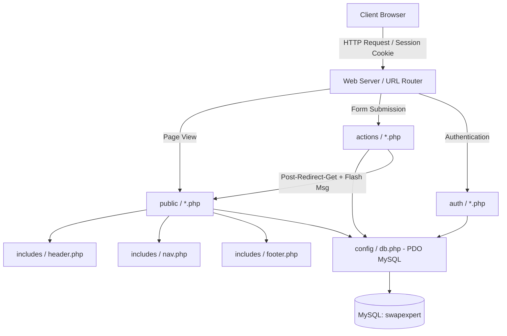

# SkillExpert — Peer-to-Peer Skills Trading Platform

> **UECS2094 / UECS2194 / EECS2194 Web Application Development Group Assignment**  
> A peer-to-peer skills exchange platform where members teach what they know and learn what they do not—trading expertise directly through time and credits rather than paying monetary fees.

[](https://www.php.net/)
[](https://www.mysql.com/)
[](#project-structure)
[](#design-system--styling)

Built strictly with **Vanilla HTML, CSS, JavaScript, PHP (PDO), and MySQL**—completely framework-free without external CSS or JS dependencies, in accordance with the assignment's technology guidelines and constraints.

---

## Table of Contents

1. [Requirements & Prerequisites](#1-requirements--prerequisites)
2. [Database Setup](#2-database-setup)
3. [Running the Project](#3-running-the-project)
4. [Demo Accounts & Pre-seeded States](#4-demo-accounts--pre-seeded-states)
5. [Key Features & Modules](#5-key-features--modules)
6. [Module Ownership & Team Attribution](#6-module-ownership--team-attribution)
7. [Technical Architecture](#7-technical-architecture)
8. [Design System & Modular CSS](#8-design-system--modular-css)
9. [Security Implementation](#9-security-implementation)
10. [Project Directory Structure](#10-project-directory-structure)
11. [Known Issues](#11-known-issues)

---

## 1. Requirements & Prerequisites

- **PHP 8.x** with the `pdo_mysql` and `mbstring` extensions enabled.
- **MySQL 5.7+** or **MariaDB 10.x+**.
- Any local web server environment (WampServer, XAMPP, MAMP, or PHP CLI built-in server).

---

## 2. Database Setup

1. Start your MySQL/MariaDB server.
2. Import the schema script (this automatically creates the `swapexpert` database, all tables, constraints, foreign keys, and seed test data so the platform is immediately clickable):

   ```bash
   mysql -u root -p < database/schema.sql
   ```

3. Ensure [config/db.php](config/db.php) matches your local database credentials:

   ```php
   $host     = 'localhost';
   $dbname   = 'swapexpert';
   $username = 'root';
   $password = ''; // Set your MySQL password if configured
   ```

---

## 3. Running the Project

The site expects to be served from a folder named `main` on your web root (all internal links use absolute root paths such as `/main/public/index.php`, `/main/auth/login.php`, etc.).

### Option A — WampServer / XAMPP / MAMP (Recommended)
Place or symlink this project folder into your server's web root (`www` or `htdocs`) and name the directory `main`:
- **WampServer**: `c:\wamp64\www\main\`
- **XAMPP**: `C:\xampp\htdocs\main\`

Then visit in your browser:
```
http://localhost/main/public/index.php
```

### Option B — PHP Built-in Web Server (CLI)
From the directory that contains the `main` project folder (or by creating a directory alias):

```bash
# In the directory containing 'main':
php -S localhost:8000
```

Then visit:
```
http://localhost:8000/main/public/index.php
```

---

## 4. Demo Accounts & Pre-seeded States

The database seed data provides preconfigured accounts with populated exchanges across every swap status:

| Name | Email | Password | Pre-seeded Activity |
|---|---|---|---|
| **Alice Tan** | `alice@example.com` | `Password123!` | Guitar Tutor — **Completed** swap with Ben (mutual 5-star reviews) |
| **Ben Osman** | `ben@example.com` | `Password123!` | Spanish Tutor — **Completed** swap with Alice; **Pending** request on Alice's guitar |
| **Chandra Lee** | `chandra@example.com` | `Password123!` | Data Analyst — **Accepted** (in-progress) swap with Divya; 2 Saved wishlist items |
| **Divya Nair** | `divya@example.com` | `Password123!` | Art Tutor — **Accepted** swap with Chandra |

> **Exchange Flow Ready for Testing**:
> - **Alice ↔ Ben** already have a **completed** swap with reviews on both sides.
> - **Chandra ↔ Divya** have an **accepted** (in-progress) swap.
> - **Ben** has a **pending** request on Alice's guitar listing.
> 
> *Every swap status (`pending`, `accepted`, `completed`, `declined`, `cancelled`) and the full review workflow can be tested immediately upon login without creating manual records first.*

---

## 5. Key Features & Modules

### 🏠 1. Landing & Discovery ([public/index.php](public/index.php))
- **Hero Showcase**: Dark-themed lavender glow hero with an interactive skill-exchange card.
- **Featured Skills**: Dynamically fetched listings with category tags, teacher metadata, and hover elevation effects.
- **How It Works**: 3-step community exchange workflow guide.

### 🔍 2. Real-Time Skills Catalog ([public/browse.php](public/browse.php))
- **Live Search**: Instant client-side text filtering by skill title, description, or teacher name ([browse.js](assets/js/browse.js)).
- **Category Filter Pills**: Filter across *Programming, Design, Language, Music, Sports, Academic,* and *Other*.
- **Exchange Statistics**: Visual tags indicating verified completed swaps for each listing.

### 📄 3. Skill Detail & Proposal Hub ([public/details.php](public/details.php))
- **Listing Overview**: Teacher profile badge, category pill, comprehensive syllabus/description, and aggregate star ratings.
- **Swap Proposal Form**: Logged-in users can propose an exchange, optionally offering one of their own posted skills with a custom note.
- **Wishlist Integration**: One-click bookmarking (*Save for Later* / *Unsave*) with real-time UI state toggle.
- **Verified Reviews**: Star ratings (1–5) and feedback visible only from users who completed an exchange.
- **Community Q&A**: Public discussion thread where any authenticated member can ask questions before proposing a swap.

### ✦ 4. Interactive Skill Creation ([public/posting.php](public/posting.php))
- **3D Interactive Hero**: Dynamic card tracking mouse movement via CSS `perspective` and matrix transforms.
- **Live Typing Preview**: Side-by-side card preview updating title, category, and description in real-time with character counters.
- **Form Guards**: Category selectors with active states and double-submission protection.

### 🛠️ 5. Skill Management Dashboard ([public/my_skills.php](public/my_skills.php))
- **Owner Controls**: Dedicated workspace for users to manage their own skill listings.
- **Inline Editing**: Full editing interface for title, category, and description updates.
- **Safe Cascade Deletion**: Skill deletion with impact notices and database cascading.

### ⇄ 6. Swap Exchange Lifecycle ([public/swaps.php](public/swaps.php) & [public/teaching_requests.php](public/teaching_requests.php))
- **Incoming / Outgoing Tracking**: Tabbed interface managing requests across all lifecycle states:
  $$\text{Pending} \longrightarrow \text{Accepted} \longrightarrow \text{Completed}$$
  $$\text{Pending} \longrightarrow \text{Declined} \quad\text{or}\quad \text{Cancelled (Withdrawn)}$$
- **Teaching Requests Portal**: Focused view for skill owners to accept, decline, or mark completed sessions.
- **Review Prompting**: Triggers review forms immediately upon marking a swap as `completed`.

### 🔖 7. Bookmarked Wishlist ([public/saved.php](public/saved.php))
- Dedicated wishlist grid allowing users to quickly access bookmarked skills and initiate exchanges.

### ✉️ 8. Contact & Support ([public/contact.php](public/contact.php))
- Direct inquiry form with auto-prefilling for authenticated users and database logging.

### 🔐 9. Authentication & Session Security ([auth/](auth/))
- Secure registration (5 complimentary starting credits), bcrypt password hashing, login verification, and session fixation guards.

---

## 6. Module Ownership & Team Attribution

- **Authentication, Navigation, Skills (Posting, Browse, Details layout, Home)**: Teammate
- **Swap Requests, Teaching Requests, Accept/Decline/Complete flow, Verified Reviews, Comments/Q&A, Contact, Wishlist**: Barry
  - *Refer to [docs/report_content_swaps_reviews.md](docs/report_content_swaps_reviews.md) for the detailed implementation walkthrough used in the project report.*

---

## 7. Technical Architecture



### Architectural Highlights
- **Post/Redirect/Get (PRG) Pattern**: All state mutations (`actions/*.php`) process `POST` requests and redirect with session-backed flash notifications (`setFlash()` / `getAndClearFlash()`) to eliminate duplicate form submissions on page refresh.
- **Separation of Concerns**: Modular split between business logic (`actions/`), presentation templates (`public/`), reusable UI partials (`includes/`), and shared database utilities.
- **Defensive Session Management**: Project-wide session contract (`$_SESSION['user_id']`, `$_SESSION['name']`) with centralized route guards (`auth/session_check.php`).

---

## 8. Design System & Modular CSS

The platform adopts a unified **Lavender & Royal Violet** palette (`#8b5cf6`, `#7c3aed`, `#a78bfa`, `#c4b5fd`, `#ede9fe`). 

Rather than bloating a single stylesheet, each module is decoupled into a dedicated file:

| Stylesheet | Responsibility |
|---|---|
| [assets/css/style.css](assets/css/style.css) | Core CSS variables, typography, navigation bar, footer, buttons, flash alerts, and badges |
| [assets/css/home.css](assets/css/home.css) | Dark gradient glow hero, live exchange visual, featured cards grid, and step guides |
| [assets/css/browse.css](assets/css/browse.css) | Search hero, category filter pills bar, catalog grid layout, and empty states |
| [assets/css/details.css](assets/css/details.css) | Skill hero card, star rating widgets, review list, and discussion threads |
| [assets/css/skills-posting.css](assets/css/skills-posting.css) | 3D perspective animations, category showcase carousel, and live preview card |
| [assets/css/swaps.css](assets/css/swaps.css) | Tab switchers, status-colored cards, exchange notes, and action button groups |
| [assets/css/saved.css](assets/css/saved.css) | Wishlist grid, owner management forms, and deletion notices |
| [assets/css/contact.css](assets/css/contact.css) | Split info cards, social pills, and input focus states |
| [assets/css/auth.css](assets/css/auth.css) | Centered card layout, brand logo badges, and form elements |

### Cache-Busting
All stylesheets and scripts are linked with dynamic modification timestamps (`?v=<?php echo filemtime(...); ?>`), ensuring updates are rendered immediately by the browser without manual hard refreshes.

---

## 9. Security Implementation

1. **SQL Injection Prevention**:
   All database queries are executed using **PDO Prepared Statements** with parameterized inputs (`$stmt->prepare()` and `$stmt->execute([...])`).
2. **Cross-Site Scripting (XSS) Mitigation**:
   All dynamic user outputs are sanitized using `htmlspecialchars($data, ENT_QUOTES, 'UTF-8')`.
3. **Password Security**:
   Passwords are never stored in plaintext. Encrypted via PHP's native `password_hash($password, PASSWORD_DEFAULT)` using salted bcrypt hashing and verified with `password_verify()`.
4. **Session Fixation Defense**:
   `session_regenerate_id(true)` is executed immediately upon successful authentication.
5. **Authorization & Ownership Checks**:
   Action handlers verify that `$_SESSION['user_id']` strictly matches listing or request ownership before permitting update or delete mutations.

---

## 10. Project Directory Structure

```
c:/wamp64/www/main/
├── actions/                   # POST mutation handlers (PRG pattern)
│   ├── comment_delete.php     # Deletes a skill discussion comment
│   ├── comment_submit.php     # Adds a comment to a skill listing
│   ├── contact_submit.php     # Processes contact form submissions
│   ├── create_skills.php      # Creates a new skill listing
│   ├── review_delete.php      # Removes a review
│   ├── review_submit.php      # Submits a verified swap review
│   ├── skill_delete.php       # Cascades deletion for user-owned skill
│   ├── skill_save.php         # Bookmarks skill to wishlist
│   ├── skill_unsave.php       # Removes skill from wishlist
│   ├── skill_update.php       # Updates title, category & description
│   ├── swap_request_action.php# Handles accept, decline, cancel & complete
│   └── swap_request_create.php# Initiates a new swap proposal
├── assets/                    # Static front-end assets
│   ├── css/                   # Modular CSS stylesheets
│   │   ├── auth.css           # Login & Registration styling
│   │   ├── browse.css         # Catalog & filter bar styling
│   │   ├── contact.css        # Contact layout styling
│   │   ├── details.css        # Skill details & reviews styling
│   │   ├── home.css           # Landing page & hero styling
│   │   ├── saved.css          # Wishlist & skill management styling
│   │   ├── skills-posting.css # 3D publisher & interactive preview styling
│   │   ├── style.css          # Global design tokens, navbar, footer & alerts
│   │   └── swaps.css          # Swap lifecycle & dashboard styling
│   ├── img/                   # Brand marks & logo assets
│   └── js/                    # Client-side JavaScript
│       ├── browse.js          # Real-time search & category filtering
│       ├── skills-posting.js  # Live typing preview & 3D card tilt
│       └── swaps.js           # Form confirmation & validation guards
├── auth/                      # Authentication & session controllers
│   ├── login.php              # Login view & authentication handler
│   ├── logout.php             # Session termination & cleanup
│   ├── register.php           # Registration view & account creator
│   └── session_check.php      # Route protection middleware
├── config/                    # Global configuration
│   └── db.php                 # PDO database instance initialization
├── database/                  # Database scripts
│   └── schema.sql             # Table declarations, constraints & seed data
├── docs/                      # Technical documentation & report walkthroughs
├── includes/                  # Reusable PHP partials & helper functions
│   ├── footer.php             # Global HTML footer & scripts
│   ├── header.php             # HTML head, dynamic title & session starter
│   ├── nav.php                # Responsive navigation bar with auth states
│   ├── review_form_partial.php# Verified review rating form
│   ├── saved_functions.php    # Wishlist helper queries
│   └── swap_functions.php     # Swap lifecycle, badges & flash helpers
└── public/                    # User-facing web pages
    ├── browse.php             # Skills catalog with search & filters
    ├── contact.php            # Contact & feedback page
    ├── details.php            # Skill details, proposal form & reviews
    ├── index.php              # Platform landing page
    ├── my_skills.php          # Owner skill management (Edit / Delete)
    ├── posting.php            # 3D interactive skill publisher
    ├── saved.php              # Bookmarked wishlist
    ├── swaps.php              # Exchange lifecycle dashboard
    └── teaching_requests.php  # Incoming learner requests portal
```

---

## 11. Known Issues

**Currently None-Major Issues** — all previously identified class name mismatches, stylesheet bloat, unstyled placeholders, and cascade constraints have been resolved and tested.

**Requiring Deep Module Testing**

**Some Probable offset layout or styling issues need to be fixed**
