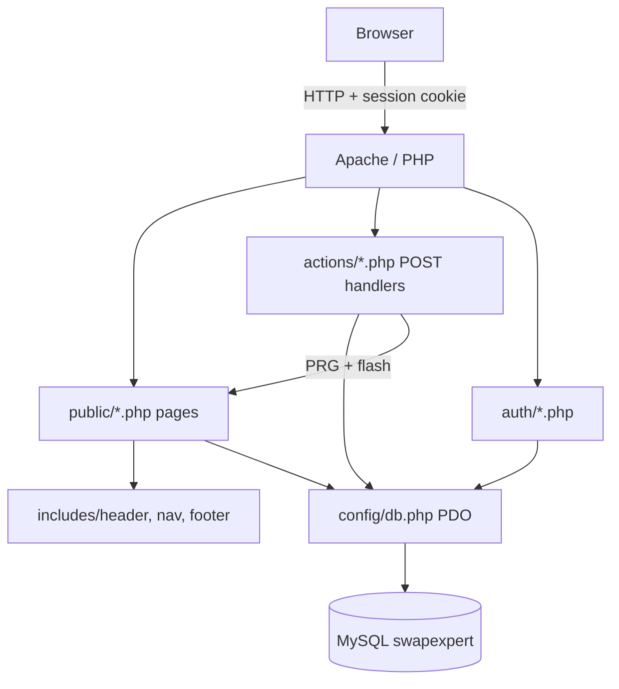

# SkillExpert — Peer-to-Peer Skills Trading Platform

> **UECS2094 / UECS2194 / EECS2194 Web Application Development Group Assignment**  
> A peer-to-peer skills exchange platform where members teach what they know and learn what they do not—trading expertise through skill barter or a simple time-credit economy.

[](https://www.php.net/)
[](https://www.mysql.com/)
[](#7-technical-architecture)
[](#8-design-system--modular-css)

Built with **Vanilla HTML, CSS, JavaScript, PHP (PDO), and MySQL** — no frameworks, no external CSS/JS libraries.

---

## Table of Contents

1. [Requirements & Prerequisites](#1-requirements--prerequisites)
2. [Database Setup](#2-database-setup)
3. [Running the Project](#3-running-the-project)
4. [Demo Accounts & Test Scenarios](#4-demo-accounts--test-scenarios)
5. [Key Features & Modules](#5-key-features--modules)
6. [Credit Economy](#6-credit-economy)
7. [Technical Architecture](#7-technical-architecture)
8. [Design System & Modular CSS](#8-design-system--modular-css)
9. [Security Implementation](#9-security-implementation)
10. [Project Directory Structure](#10-project-directory-structure)
11. [Assignment Requirements Map](#11-assignment-requirements-map)
12. [Further Documentation](#12-further-documentation)

---

## 1. Requirements & Prerequisites

- **PHP 8.x** with `pdo_mysql` and `mbstring` enabled
- **MySQL 5.7+** or **MariaDB 10.x+**
- A local web server (WampServer, XAMPP, MAMP, or PHP built-in server)

---

## 2. Database Setup

1. Start MySQL/MariaDB.
2. Import the schema (creates `swapexpert`, all tables, constraints, and seed data):

   ```bash
   mysql -u root -p < database/schema.sql
   ```

3. Match credentials in [config/db.php](config/db.php):

   ```php
   $host     = 'localhost';
   $dbname   = 'swapexpert';
   $username = 'root';
   $password = ''; // your local password if set
   ```

### Tables (8)

| Table | Purpose |
|---|---|
| `users` | Accounts, bcrypt password hash, live `creditsBalance` |
| `skills` | Posted skill listings |
| `swapRequests` | Swap lifecycle (`pending` → `accepted` → `completed`, etc.) |
| `reviews` | Verified reviews (one per user per completed swap) |
| `comments` | Open Q&A on skill listings |
| `savedSkills` | Wishlist junction |
| `contactMessages` | Contact form submissions |
| `creditTransactions` | Optional audit log of credit changes (see [Credit Economy](#6-credit-economy)) |

---

## 3. Running the Project

All internal links assume the project folder is named **`main`** on the web root.

### WampServer / XAMPP / MAMP (recommended)

```
c:\wamp64\www\main\
```

Open:

```
http://localhost/main/public/index.php
```

### PHP built-in server

```bash
php -S localhost:8000
```

Then visit `http://localhost:8000/main/public/index.php`.

---

## 4. Demo Accounts & Test Scenarios

Password for all demo accounts: **`Password123!`**

| Name | Email | Starting credits | Pre-seeded activity |
|---|---|---:|---|
| Alice Tan | `alice@example.com` | 5 | Guitar tutor; completed barter swap with Ben; incoming requests |
| Ben Osman | `ben@example.com` | 5 | Spanish tutor; completed swap with Alice |
| Chandra Lee | `chandra@example.com` | 5 | Excel tutor; accepted swap with Divya; 2 saved skills |
| Divya Nair | `divya@example.com` | 5 | Art tutor; accepted swap with Chandra |

**Quick test paths after import:**

| Goal | Steps |
|---|---|
| Browse & filter | Open Browse → filter by Music / Language |
| Request a swap | Log in → skill details → propose exchange |
| Accept / complete | Log in as skill owner → My Teaching Requests |
| Credit transfer | Complete a swap **without** offering your own skill → requester −1, teacher +1 |
| Barter (no credits) | Offer your skill in the swap form → complete → balances unchanged |
| Review | After completed swap → My Swaps → submit star rating |
| Wishlist | Skill details → Save for Later → Saved page |
| Credits history | Click credit badge in nav → My Credits |

---

## 5. Key Features & Modules

### Landing & Discovery — [public/index.php](public/index.php)
Hero, featured skills grid, and a 3-step “how it works” guide.

### Skills Catalog — [public/browse.php](public/browse.php) + [assets/js/browse.js](assets/js/browse.js)
Live client-side search and category filter pills (*Programming, Design, Language, Music, Sports, Academic, Other*).

### Skill Details — [public/details.php](public/details.php)
Full listing view, swap proposal form (barter or credit), wishlist toggle, verified reviews, and Q&A comments.

### Post a Skill — [public/posting.php](public/posting.php) + [assets/js/skills-posting.js](assets/js/skills-posting.js)
Interactive 3D hero, live preview card, category picker. Guests see a sign-up prompt; logged-in users publish via [actions/create_skills.php](actions/create_skills.php).

### My Skills — [public/my_skills.php](public/my_skills.php)
Owner dashboard: edit title/category/description, delete own listings.

### Swap Lifecycle — [public/swaps.php](public/swaps.php), [public/teaching_requests.php](public/teaching_requests.php)
Received/sent tabs, accept / decline / cancel / complete, inline review forms after completion.

### Wishlist — [public/saved.php](public/saved.php)
Bookmarked skills with quick access to details and unsave.

### Contact — [public/contact.php](public/contact.php)
Info panel + working form stored in `contactMessages`. Available to guests and logged-in users (nav shows Contact in both states).

### Credits — [public/credits.php](public/credits.php)
Current balance, economy rules, and transaction history. Linked from the nav credit badge.

### Authentication — [auth/](auth/)
Register (5 welcome credits), login, logout, `session_check.php` route guard, bcrypt hashing, session regeneration.

---

## 6. Credit Economy

SkillExpert supports **two exchange modes**:

| Mode | When | On complete |
|---|---|---|
| **Skill barter** | Requester offers one of their own skills (`offeredSkillId` set) | No credit change |
| **Credit learn** | Open request (no skill offered) | Requester −1, teacher +1 |

New members receive **5 welcome credits** on registration. Completion is blocked if the requester has fewer than 1 credit (flash error on swaps page). Logic lives in `completeSwapWithCredits()` inside [includes/swap_functions.php](includes/swap_functions.php) — a single PDO transaction with row locks.

### Is `creditTransactions` redundant?

**Short answer: no — but it is optional for this assignment's core requirements.**

| Field / table | Role |
|---|---|
| `users.creditsBalance` | **Source of truth for “how many credits do I have right now?”** — used by nav, swap completion checks, and the swap form hint |
| `creditTransactions` | **Audit log** — answers “why did my balance change?” on the My Credits page |

They are not duplicates of the same data:

- The balance is a **running total** (fast to read; one `SELECT` in the nav).
- The ledger is an **append-only history** (welcome bonus, learn debit, teach credit).

**Could you drop the ledger?** Yes. For a minimal version you would keep only `creditsBalance`, remove `creditTransactions` and `public/credits.php`, and show credits only in the nav. History could be *reconstructed* from completed `swapRequests` where `offeredSkillId IS NULL`, but you would lose a clean record of the welcome bonus and any future adjustments.

**Why keep it here:** It is a small, standard pattern (balance + ledger) that makes the My Credits page honest and demo-friendly without recomputing history in PHP. If you prefer less schema for the report, say so — the economy still works with balance-only.

---

## 7. Technical Architecture



**Patterns used**

- **Post/Redirect/Get** — all mutations redirect with one-time flash messages (`setFlash()` / `getAndClearFlash()`)
- **PDO prepared statements** everywhere — no string-concatenated SQL
- **Session contract** — `$_SESSION['user_id']`, `$_SESSION['name']`; protected pages include `auth/session_check.php`
- **CSS-only mobile nav** and swap tabs — works without JavaScript; JS adds confirm dialogs and form helpers only

---

## 8. Design System & Modular CSS

**Palette:** Lavender & royal violet (`#9b7cf7`, `#8b5cf6`, `#7c3aed`). Home hero uses an intentional dark gradient; inner pages use a light surface.

Global layout is split across three shared files loaded from [includes/header.php](includes/header.php):

| File | Role |
|---|---|
| [assets/css/style.css](assets/css/style.css) | Design tokens, base typography |
| [assets/css/layout.css](assets/css/layout.css) | Navigation, footer, credit badge |
| [assets/css/components.css](assets/css/components.css) | Buttons, badges, flash alerts, forms |

Page-specific stylesheets:

| File | Page(s) |
|---|---|
| [home.css](assets/css/home.css) | Landing |
| [browse.css](assets/css/browse.css) | Catalog |
| [details.css](assets/css/details.css) | Skill details |
| [skills-posting.css](assets/css/skills-posting.css) | Post a skill |
| [swaps.css](assets/css/swaps.css) | Swaps, teaching requests |
| [saved.css](assets/css/saved.css) | Wishlist, my skills |
| [contact.css](assets/css/contact.css) | Contact |
| [auth.css](assets/css/auth.css) | Login / register |
| [credits.css](assets/css/credits.css) | Credits & ledger |

Assets use `?v=<?php echo filemtime(...); ?>` cache-busting.

---

## 9. Security Implementation

1. **SQL injection** — PDO prepared statements with bound parameters
2. **XSS** — `htmlspecialchars($data, ENT_QUOTES, 'UTF-8')` on output
3. **Passwords** — `password_hash()` / `password_verify()` (bcrypt)
4. **Session fixation** — `session_regenerate_id(true)` on login/register
5. **Authorization** — ownership and swap-participant checks in every action handler before `UPDATE` / `DELETE`

---

## 10. Project Directory Structure

```
main/
├── actions/              # POST handlers (PRG)
├── assets/css/           # Modular stylesheets
├── assets/js/            # browse.js, skills-posting.js, swaps.js
├── assets/img/           # Logo
├── auth/                 # login, register, logout, session_check
├── config/db.php         # PDO connection
├── database/schema.sql   # Schema + seed data
├── docs/                 # Report walkthrough content
├── includes/             # header, nav, footer, swap/saved helpers
└── public/               # User-facing pages
    ├── index.php
    ├── browse.php
    ├── details.php
    ├── posting.php
    ├── my_skills.php
    ├── swaps.php
    ├── teaching_requests.php
    ├── saved.php
    ├── contact.php
    └── credits.php
```

---

## 11. Assignment Requirements Map

| Req | Description | Implementation |
|:---:|---|---|
| I | Home | `public/index.php` |
| II | CRUD (multiple) | Skills, swaps, reviews, comments, contact, wishlist |
| III | Navigation | `includes/nav.php` — login-aware, responsive |
| IV | Contact | `public/contact.php` + `contactMessages` table |
| V | Listing + filter | `public/browse.php` + category pills + search |
| VI | Item details | `public/details.php` |
| VII | Wishlist | `public/saved.php` + `savedSkills` |
| VIII | Login / register | `auth/` |
| IX | Responsive | CSS media queries (no framework) |

---


## 12. Further Documentation

- [docs/GUIDE_DOCS.md](docs/GUIDE_DOCS.md) — Full beginner walkthrough: folders, database, features, how to trace code

---

## Status

Core assignment requirements, full CRUD, swap lifecycle, verified reviews, wishlist, contact, and the credit economy are implemented and tested on WampServer. 
